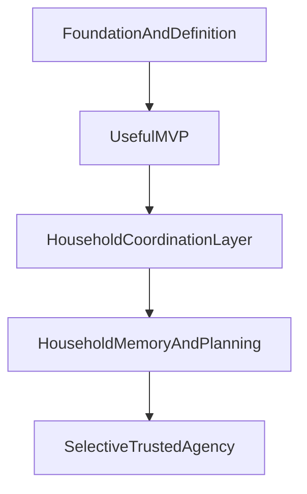

# Olivia Roadmap

## Purpose
This roadmap describes the broader product trajectory for Olivia beyond the immediate MVP. It should answer where the product is headed over time, what capabilities are likely to matter next, and how the product might expand after the first useful slice proves itself.

This document is intentionally different from `docs/roadmap/milestones.md`:
- the roadmap is strategic and future-looking
- the milestones are readiness gates with evidence requirements

## Roadmap Principles
- Build toward a focused household command center, not a broad assistant.
- Prioritize shared household state and follow-through before wider automation.
- Earn trust with legible, advisory behavior before expanding autonomy.
- Preserve reversibility in interface and infrastructure decisions while product value is still being validated.
- Expand based on lived household usefulness, not speculative feature ambition.

## Strategic Arc

## Horizon 1: Foundation And Definition
Focus: define the product clearly enough that future work compounds rather than drifts.

This horizon is about establishing:
- product vision and ethos
- agentic documentation standards
- durable project memory
- the first clear product wedge

Success at this horizon means Olivia has a strong product center of gravity before substantial implementation begins.

## Horizon 2: Useful MVP
Focus: deliver one narrow but genuinely valuable workflow around shared household state and follow-through.

Recommended product shape:
- advisory-only behavior
- local-first data handling
- text-first interaction
- an installable mobile-first PWA as the near-term canonical surface
- explicit ownership, status, reminders, and next-step visibility
- a primary-operator model for the stakeholder, with spouse visibility or lightweight participation allowed but full collaboration deferred

The goal is not a complete assistant. The goal is a workflow the household would actually miss if it disappeared.

## Horizon 3: Household Coordination Layer
Focus: expand from one useful workflow into a coherent coordination surface for routine household operations.

Likely capabilities:
- stronger shared task and obligation tracking
- reminder and planning support tied to household context
- more complete visibility into who owns what and what is approaching
- better support for spouse participation and shared household use

This is where Olivia starts to feel less like a single tool and more like a household coordination layer.

## Horizon 4: Household Memory And Planning
Focus: become a durable operational memory for the household, not only a current-state tracker.

Likely capabilities:
- richer recall of prior plans, decisions, and important context
- support for recurring planning rituals and household review
- stronger summarization of what changed, what matters, and what needs attention
- clearer continuity across tasks, schedules, reminders, and notes

This horizon matters because household management is not only about what is due next. It is also about preserving context over time.

## Horizon 5: Selective Trusted Agency
Focus: cautiously introduce limited automation only after the product is trusted and the rules are explicit.

Possible future direction:
- low-risk recurring actions with clear user-defined rules
- proactive nudges or preparation behaviors within bounded scope
- selective execution only where approval and auditability remain legible

This is intentionally later. Olivia should earn the right to act by first proving it can organize, clarify, and advise well.

## Near-Term Product Bets
- The first enduring value will come from reducing coordination overhead, not from maximizing AI novelty.
- Shared state and follow-through will likely unlock adjacent value in reminders, planning, and memory.
- Household usefulness should be proven in real life before broadening the interface or autonomy model.

## Expansion Areas To Revisit Later
- broader multi-user roles and permissions
- richer spouse-specific experiences
- voice interaction
- proactive planning rituals
- selective low-risk automation
- more than one interface surface if justified by usage

## What The Roadmap Deliberately Does Not Do
- It does not define artifact-level completion criteria.
- It does not act as the project plan or implementation checklist.
- It does not lock in the exact stack, deployment model, or long-term interface.

## Decisions
- The roadmap should remain broader and more future-looking than the milestone system.
- Product expansion should move from usefulness to coordination to memory to selective agency.
- Full autonomy is not a near-term goal.

## Assumptions
- A narrow MVP will create more durable value than attempting broad assistant capabilities early.
- The best early validation will come from real household use by the stakeholder and spouse.
- Long-term interface decisions can remain flexible beyond the chosen PWA MVP surface until product usage reveals whether native clients or other surfaces deserve to become primary.

## Open Questions
- What is the minimum notification set that supports the PWA MVP without creating noise?
- What evidence should justify moving beyond the PWA to native clients or a shared-display mode?
- When should spouse-specific collaborative flows become first-class rather than secondary?

## Deferred Decisions
- Detailed multi-user roles and permissions.
- Voice and proactive automation strategy.
- Final architecture and deployment model.
