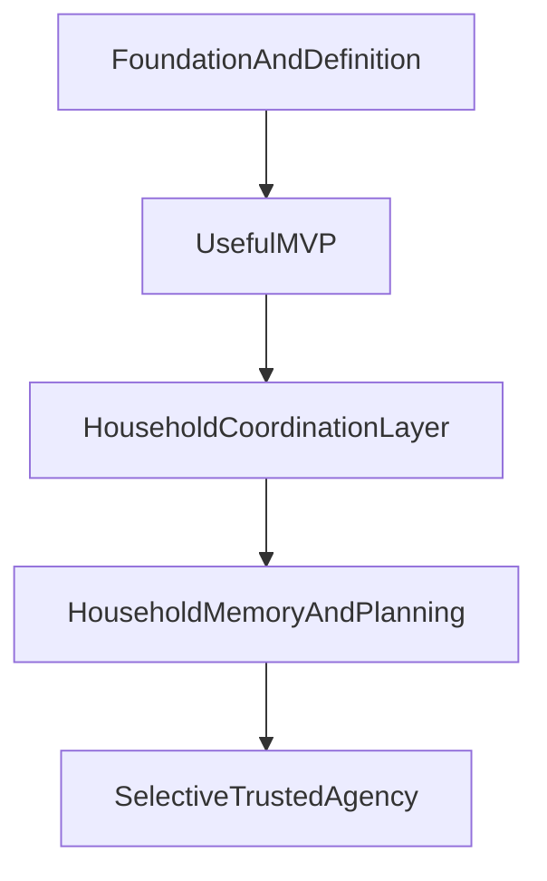

# Olivia Roadmap

## Purpose
This roadmap describes the broader product trajectory for Olivia beyond the immediate MVP. It should answer where the product is headed over time, what capabilities are likely to matter next, and how the product might expand after the first useful slice proves itself.

This document is intentionally different from `docs/roadmap/milestones.md`:
- the roadmap is strategic and future-looking
- the milestones are readiness gates with evidence requirements

## Roadmap Principles
- Build toward a focused household command center, not a broad assistant.
- Prioritize shared household state and follow-through before wider automation.
- Earn trust with legible, advisory behavior before expanding autonomy.
- Preserve reversibility in interface and infrastructure decisions while product value is still being validated.
- Expand based on lived household usefulness, not speculative feature ambition.

## Strategic Arc

## Horizon 1: Foundation And Definition
Status: complete

Focus: define the product clearly enough that future work compounds rather than drifts.

This horizon is about establishing:
- product vision and ethos
- agentic documentation standards
- durable project memory
- the first clear product wedge

Delivered foundation:
- durable product docs that define Olivia's purpose, trust model, and PM operating model
- a learnings system for assumptions, decisions, and reusable takeaways
- a roadmap and milestone model future agents can use to orient quickly

Success at this horizon means Olivia has a strong product center of gravity before substantial implementation begins.

## Horizon 2: Useful MVP
Status: complete

Focus: deliver one narrow but genuinely valuable workflow around shared household state and follow-through.

Recommended product shape:
- advisory-only behavior
- local-first data handling
- text-first interaction
- an installable mobile-first PWA as the near-term canonical surface
- explicit ownership, status, reminders, and next-step visibility
- a primary-operator model for the stakeholder, with spouse visibility or lightweight participation allowed but full collaboration deferred

Delivered MVP shape:
- a working shared household inbox workflow across the PWA, API, domain layer, and shared contracts
- approval-aware writes, local-first persistence, and a mobile-first review surface
- a concrete product and architecture center of gravity future work can extend rather than re-invent

The goal is not a complete assistant. The goal is a workflow the household would actually miss if it disappeared.

## Horizon 3: Household Coordination Layer
Status: complete

Focus: expand from one useful workflow into a coherent coordination surface for routine household operations.

Product direction:
- turn reminders into a first-class capability rather than only an inbox item property
- add recurring routines for chores, maintenance, bills, and other repeated household obligations
- introduce shared lists for grocery, shopping, packing, and other lightweight collaborative list workflows
- extend the inbox into a broader coordination layer with clearer ownership, due-state visibility, and planning views
- meal planning as the final Horizon 3 workflow, connecting to shared lists for grocery generation

Near-term workflow priorities:
1. ~~first-class reminders~~ — spec approved, implemented (Phase 1 complete)
2. ~~shared lists~~ — spec approved, implemented (Phase 1 complete)
3. ~~recurring routines~~ — spec approved, implemented (all 7 phases complete)
4. ~~meal planning~~ — spec approved (D-021), implemented (Phase 1 complete). Weekly meal planning with grocery list generation via Shared Lists. See D-019, D-020, D-021.

All four planned Horizon 3 workflows are built and available in the PWA. Horizon 3 is near-complete; remaining expansion (if any) would be driven by M29 usage signal.

How Horizon 3 builds on the MVP:
- the inbox remains the capture and follow-through foundation for open household work
- reminders and recurring routines should reuse the same trust model, ownership model, and history expectations where possible
- shared lists should feel adjacent to the inbox, but not be forced into the inbox model if list behavior is materially different
- meal planning should connect cleanly to shared lists and routine planning rather than becoming a standalone kitchen app

This is where Olivia starts to feel less like a single tool and more like a household coordination layer.

## Horizon 4: Household Memory And Planning
Status: complete

Focus: become a durable operational memory for the household, not only a current-state tracker.

By the end of Horizon 3, Olivia surfaces what is active right now. Horizon 4 adds the temporal dimension: what happened last week, what is coming up, and how the household is doing over time.

Near-term workflow priorities:
1. unified weekly view — a single surface that shows the household's week at a glance across all H3 workflow types (routines scheduled, meals planned, reminders due, inbox items outstanding). This is the coordination layer's natural command center summary.
2. activity history — recall what the household accomplished: completed routines, used recipes, triggered reminders, closed inbox items. Answers "what did we actually do?" rather than only "what is open?"
3. planning ritual support — structured recurring workflows for household review, building on recurring routines primitives. A weekly review routine that auto-summarizes state rather than requiring manual reconstruction.

How Horizon 4 builds on Horizon 3:
- all four H3 workflows (reminders, shared lists, recurring routines, meal planning) produce events that feed the timeline and weekly view
- the unified view does not add new entities — it surfaces existing entities in a cross-workflow temporal context
- planning rituals are recurring routines with memory-aware content rather than a new workflow primitive

First spec target: unified weekly view.

Likely later capabilities:
- stronger AI-driven summarization of what changed, what matters, and what needs attention
- clearer continuity across tasks, schedules, reminders, and notes across longer time horizons

This horizon matters because household management is not only about what is due next. It is also about preserving context over time.

## Horizon 5: Selective Trusted Agency
Status: active

Focus: introduce the first layer of trusted agency — AI-assisted content generation and proactive temporal nudges — building directly on the H4 temporal layer that is now complete.

What H4 enables for H5:
- Activity history and the unified weekly view together create a rich, structured temporal dataset that Olivia can now use as AI input rather than only displaying it
- The planning ritual creates a natural trusted-agency touchpoint where AI-assisted draft content has immediate household value: generating the "last week recap" and "coming week overview" from real H4 data instead of requiring manual reconstruction
- The carry-forward notes pattern in the planning ritual has a natural AI-assist angle: Olivia can suggest carry-forward items based on overdue and upcoming state from the weekly view
- The H4 temporal loop (past, present, synthesis) gives H5 a grounded dataset for both AI content generation and proactive nudge timing

Near-term workflow priorities:
1. AI-assisted planning ritual summaries — first H5 spec target (see M16)
   Olivia uses activity history and the unified weekly view to auto-draft the "last week recap" and "coming week overview" sections of the planning ritual. The household reviews, edits, and accepts the draft rather than writing from scratch. This is advisory-only: the user's accepted version is always the canonical record. External AI is used behind the provider adapter boundary established in D-008.

2. Proactive household nudges — second H5 target, sequenced after Phase 1 validation
   Olivia surfaces in-app prompts and push notifications for overdue routines (with a mark-done or skip choice), approaching reminder deadlines, and planning ritual due dates. These are agentic actions (Olivia-initiated), but remain advisory: the user decides how to respond. No record changes execute without user confirmation.

3. Rule-based automation — explicitly deferred to H5 Phase 2+
   User-defined automation rules (e.g., "auto-advance missed routine to next week", "auto-dismiss reminder after N days") are deferred until Phase 1 trusted-agency signals exist. Automation requires auditability infrastructure beyond Phase 1 scope and must not be introduced before the household has used and trusted AI-assisted content and proactive nudges.

H5 behavioral guardrails (non-negotiables for all Phase 1 work):
- AI-assisted content is always draft mode: Olivia proposes, user accepts or edits; the accepted version is the canonical record
- Proactive nudges surface via in-app prompt or push notification only; no record modifications until user acts
- External AI provider calls are scoped to content generation; no AI decision-making over household records without explicit user review
- Every AI-generated or proactively surfaced item must be visibly attributable to Olivia: the user must be able to distinguish Olivia's output from their own
- New storage is scoped to the minimum needed for AI-assisted events; the H4 pattern of minimal new tables is maintained in Phase 1

How H5 builds on H4:
- activity history and the unified weekly view become AI input surfaces, not just display surfaces
- the planning ritual becomes the first trusted-agency touchpoint where AI-generated draft content appears
- proactive nudges extend the routine and reminder scheduling model into Olivia-initiated surfaces, using the H4 temporal layer as the timing signal

This is intentionally cautious. Olivia should earn the right to act by first proving it can organize, clarify, and advise well — and H4 has now built the foundation that makes earning that right possible.

## H5 Phase 1 completion and Phase 2 direction

Phase 1 is complete: both advisory-only capabilities are built and validated (D-041, 2026-03-16).

What Phase 1 confirmed:
- Advisory-only AI integrates as a strictly additive layer — the existing planning ritual flow, all 220+ tests, and the trust model all remained intact (L-023)
- Purely-computed API endpoints (no new tables) work well for "active relevant items" surfaces — dismiss state belongs client-local in Dexie, not server-synced (L-024)
- Page Visibility API pause/resume is the correct PWA pattern for nudge polling (L-025)
- Skip-occurrence was a latent domain gap that nudges surfaced and filled — the domain model is now more complete (D-041)

H5 Phase 2 priorities (in order):

1. **Real AI provider wiring** — connect the `DisabledAiProvider` stub to a real Claude API provider behind the D-008 adapter boundary. This unlocks the AI-assisted planning ritual summaries feature for real households. The implementation path is bounded: the provider interface exists, the API routes call it, the prompts are defined. Phase 2 work is implementing `ClaudeAiProvider`, wiring API key configuration, and validating error propagation and rate limiting behavior. This is the highest-leverage Phase 2 step because it makes an already-built, already-visible user feature actually work.

2. **Push notifications for nudges** — extend the proactive nudge surface beyond in-app to device push notifications (iOS/Android). Deferred from Phase 1 because push adds device token storage, server-side scheduling, and platform permission flows that should wait until in-app nudge utility is household-validated. Sequenced after real AI wiring because in-app nudge utility must be confirmed before adding delivery surface complexity.

3. **AI-enhanced nudge timing** — improve when Olivia delivers nudges by learning from household activity patterns. This is a two-layer capability:

   **Layer 1: Completion-window-based push timing (first spec target)**
   Use historical routine completion timestamps (`routine_occurrences.completedAt`) to derive per-routine preferred completion windows — the time-of-day range when the household typically completes each routine. The push notification scheduler holds nudges for routines with a detected completion window and delivers them at the start of that window rather than immediately when the scheduler detects the overdue state. This is data-driven heuristic timing, not LLM-based. Fallback: when fewer than 4 completions exist for a routine, use the existing immediate-delivery behavior. This layer also applies to approaching reminder nudges: if the household has a pattern of resolving reminders in the evening, a reminder approaching its deadline at 3am does not need a push at 3am.

   **Layer 2: Context-aware timing (deferred to Phase 3+)**
   Use the Claude API (behind the D-008 adapter boundary) to consider cross-workflow context when making timing decisions — e.g., if the household has a meal plan tonight that implies a later evening schedule, hold the evening routine nudge. This requires richer household interaction data and validated Phase 2 timing patterns before the AI reasoning layer adds value over simple heuristics.

   How AI timing builds on push notifications (M24):
   - The `evaluateNudgePushRule` scheduler already runs every 30 minutes and makes per-nudge send/skip decisions via dedup logic. Adding timing-window checks is a bounded extension of this evaluation loop — no new scheduling infrastructure needed (L-027).
   - Timing decisions are strictly about delivery timing, not trigger conditions. The nudge trigger logic (overdue/approaching thresholds) remains deterministic and unchanged.
   - AI timing is advisory in the same sense as all H5 capabilities: it changes when Olivia speaks, not what Olivia can do. The trust model is unchanged.

   What AI timing does NOT do:
   - Does not change whether a nudge exists (trigger conditions remain deterministic)
   - Does not suppress nudges permanently — only holds delivery within a timing window; if the window passes, the nudge delivers on the next scheduler cycle
   - Does not introduce LLM calls in Layer 1 (heuristic only)
   - Does not require new entity types — timing signals are derived from existing completion timestamps

4. **Rule-based automation** — user-defined automation rules (auto-advance missed routine, auto-dismiss reminder after N days). Explicitly deferred to H5 Phase 3+. Requires auditability infrastructure, rule storage, and household trust in AI-assisted content before Olivia can act without explicit user confirmation. Must not be introduced before the household has used and trusted AI-assisted content and proactive nudges across a meaningful usage period.

## H5 Phase 2 completion and Phase 3 direction

Phase 2 is complete: all three actionable priorities are built and validated (D-052, 2026-03-16).

What Phase 2 delivered:
- Real AI provider wiring (M21/M22) — `ClaudeAiProvider` delivers real Claude Haiku content for planning ritual summaries behind the D-008 adapter boundary
- Push notifications (M23/M24) — full push delivery infrastructure with scheduler, opt-in, Service Worker, and 2-hour dedup
- AI-enhanced nudge timing Layer 1 (M25/M26/M27) — completion-window-based push timing with IQR algorithm, variance guard, lead buffer, and max hold bypass

What Phase 2 confirmed:
- The push scheduler architecture (30-min interval, per-nudge evaluation) is naturally extensible for timing optimization without new infrastructure (L-027)
- Completion-window heuristics are tractable at household scale with existing data — no LLM, no new tables, no new entity types
- The advisory-only trust model continues to hold: Phase 2 changed when and how Olivia speaks, not what Olivia can do

Phase 3 direction: **chat interface** (D-053, 2026-03-16). The board directly assigned the chat feature (OLI-95), choosing a conversational assistant surface as the next build cycle. The chat interface layers on top of existing domain capabilities — users can ask Olivia about household state, request task creation, set reminders, add list items, and interact with the full H2-H5 feature surface through natural conversation. Olivia suggests and drafts but never auto-executes; all state changes require explicit user confirmation.

Note: M28 (Household Validation & Phase 3 Scoping) was effectively bypassed by board directive. The household validation gate was skipped in favor of direct board assignment. The original Phase 3 candidates (rule-based automation, per-member push targeting, push action buttons, Layer 2 LLM timing, horizontal expansion) remain available for future cycles. Future milestones should continue to follow the gate process unless the board explicitly directs otherwise.

## H5 Phase 3 completion and Phase 4 direction

Phase 3 is complete: the chat interface is built and deployed (OLI-95 through OLI-102, 2026-03-16).

What Phase 3 delivered:
- Chat backend API with LLM integration (OLI-100) — Fastify endpoints, context assembly from all household data sources, Claude API streaming via the D-008 adapter boundary
- Chat frontend wired to backend (OLI-101) — real streaming responses, message persistence, conversation management
- A functional conversational assistant surface layered on top of the full H2-H5 feature set

What Phase 3 confirmed:
- The advisory-only trust model extends naturally to conversational interaction — draft action cards in chat follow the same confirm/dismiss pattern as structured screens
- Context assembly from existing repository queries is tractable at household scale without a separate cache layer
- The chat surface complements rather than replaces structured workflow screens

Current state: M29 (Post-Chat Household Validation & Next-Direction Scoping) is the active milestone. Three phases of H5 shipped without household validation (M28 was bypassed). M29 restores the validation gate: observe real usage across the full product surface including chat, then decide what to build next.

Phase 4 candidate tracks (to be decided by M29 usage signal):
- **Track A: Deepen the chat** — conversation summarization, proactive Olivia-initiated messages, richer tool use, spouse chat access
- **Track B: Broaden the household** — spouse write access, multi-user roles and permissions
- **Track C: Complete H3** — meal planning (spec drafted, H3 primitives proven)
- **Track D: Increase autonomy** — rule-based automation, push action buttons, Layer 2 LLM timing

## Near-Term Product Bets
- The first enduring value will come from reducing coordination overhead, not from maximizing AI novelty.
- The inbox implementation gives Olivia a stable product center; Horizon 3 should compound on that rather than reopening the MVP wedge.
- Shared state and follow-through should now expand into reminders, recurring routines, and shared lists before broader assistant behaviors.
- Meal planning is promising, but should follow only after recurring and list primitives prove they fit the household coordination model.
- Household usefulness should continue to shape expansion, but the next horizon can now be scoped from a real product baseline rather than a greenfield concept.

## Expansion Areas To Revisit Later
- broader multi-user roles and permissions
- richer spouse-specific experiences
- voice interaction
- proactive planning rituals
- selective low-risk automation
- more than one interface surface if justified by usage

## What The Roadmap Deliberately Does Not Do
- It does not define artifact-level completion criteria.
- It does not act as the project plan or implementation checklist.
- It does not lock in the exact stack, deployment model, or long-term interface.

## Decisions
- The roadmap should remain broader and more future-looking than the milestone system.
- Product expansion should move from usefulness to coordination to memory to selective agency.
- Full autonomy is not a near-term goal.

## Assumptions
- A narrow MVP will create more durable value than attempting broad assistant capabilities early.
- Shared list workflows are behaviorally distinct from inbox items and deserve their own product model. (Validated — A-007)
- Recurring schedule infrastructure can be shared across reminders, routines, and planning workflows without each feature inventing its own scheduling logic. (Validated — A-008)
- Long-term interface decisions can remain flexible beyond the chosen PWA MVP surface until product usage reveals whether native clients or other surfaces deserve to become primary.

## Open Questions
- ~~What is the minimum first-class reminder model that improves on the inbox without creating a second overlapping workflow?~~ — Answered: hybrid standalone-or-linked model (D-014, `docs/specs/first-class-reminders.md`)
- ~~How much recurrence should be defined inside the first reminder spec versus deferred to a later recurring-routines spec?~~ — Answered: shared recurrence infrastructure validated across both specs (A-008)
- ~~Which behaviors should be shared across inbox items, reminders, recurring routines, and lists, and which deserve separate workflow rules?~~ — Answered: separate workflow models with shared scheduling primitives; each workflow has distinct lifecycle rules (D-016, A-007, A-008)
- ~~How should grocery and shopping lists relate to meal planning without forcing both into the same feature too early?~~ — Answered: meal planning generates grocery lists via the Shared Lists primitive (D-021, `docs/specs/meal-planning.md`)
- What evidence should justify moving beyond the PWA to native clients or a shared-display mode?
- When should spouse-specific collaborative flows become first-class rather than secondary?

## Deferred Decisions
- Detailed multi-user roles and permissions.
- Detailed cross-workflow recurrence architecture.
- Voice and proactive automation strategy.
- Exact meal-planning product shape.
- Final architecture and deployment model.
