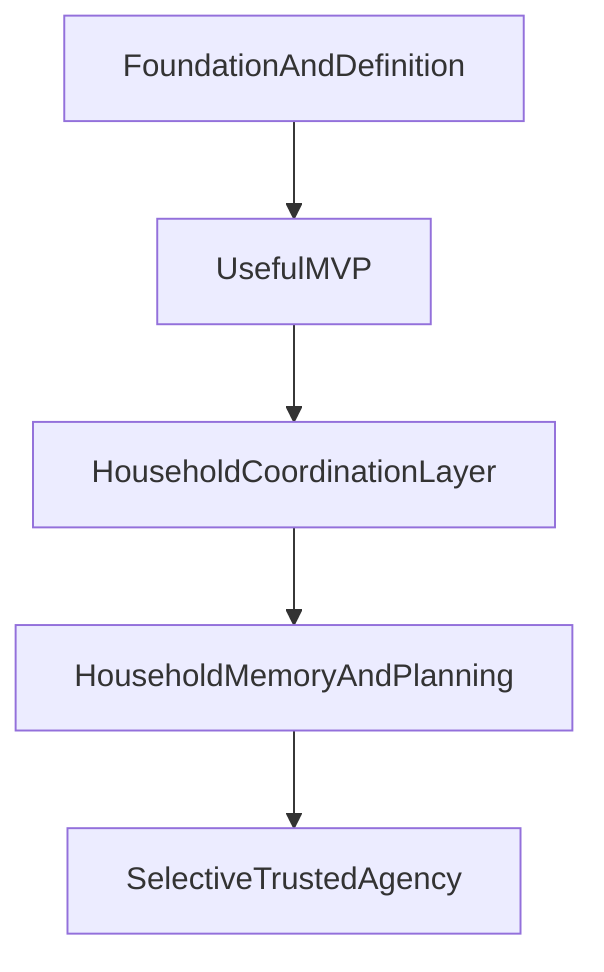

# Olivia Roadmap

## Purpose
This roadmap describes the broader product trajectory for Olivia beyond the immediate MVP. It should answer where the product is headed over time, what capabilities are likely to matter next, and how the product might expand after the first useful slice proves itself.

This document is intentionally different from `docs/roadmap/milestones.md`:
- the roadmap is strategic and future-looking
- the milestones are readiness gates with evidence requirements

## Roadmap Principles
- Build toward a focused household command center, not a broad assistant.
- Prioritize shared household state and follow-through before wider automation.
- Earn trust with legible, advisory behavior before expanding autonomy.
- Preserve reversibility in interface and infrastructure decisions while product value is still being validated.
- Expand based on lived household usefulness, not speculative feature ambition.

## Strategic Arc

## Horizon 1: Foundation And Definition
Status: complete

Focus: define the product clearly enough that future work compounds rather than drifts.

This horizon is about establishing:
- product vision and ethos
- agentic documentation standards
- durable project memory
- the first clear product wedge

Delivered foundation:
- durable product docs that define Olivia's purpose, trust model, and PM operating model
- a learnings system for assumptions, decisions, and reusable takeaways
- a roadmap and milestone model future agents can use to orient quickly

Success at this horizon means Olivia has a strong product center of gravity before substantial implementation begins.

## Horizon 2: Useful MVP
Status: complete

Focus: deliver one narrow but genuinely valuable workflow around shared household state and follow-through.

Recommended product shape:
- advisory-only behavior
- local-first data handling
- text-first interaction
- an installable mobile-first PWA as the near-term canonical surface
- explicit ownership, status, reminders, and next-step visibility
- a primary-operator model for the stakeholder, with spouse visibility or lightweight participation allowed but full collaboration deferred

Delivered MVP shape:
- a working shared household inbox workflow across the PWA, API, domain layer, and shared contracts
- approval-aware writes, local-first persistence, and a mobile-first review surface
- a concrete product and architecture center of gravity future work can extend rather than re-invent

The goal is not a complete assistant. The goal is a workflow the household would actually miss if it disappeared.

## Horizon 3: Household Coordination Layer
Status: active

Focus: expand from one useful workflow into a coherent coordination surface for routine household operations.

Product direction:
- turn reminders into a first-class capability rather than only an inbox item property
- add recurring routines for chores, maintenance, bills, and other repeated household obligations
- introduce shared lists for grocery, shopping, packing, and other lightweight collaborative list workflows
- extend the inbox into a broader coordination layer with clearer ownership, due-state visibility, and planning views
- reserve meal planning as a later Horizon 3 expansion once recurring and list primitives are clear

Near-term workflow priorities:
1. ~~first-class reminders~~ — spec approved, implemented (Phase 1 complete)
2. ~~shared lists~~ — spec approved, implemented (Phase 1 complete)
3. ~~recurring routines~~ — spec approved, implemented (all 7 phases complete)
4. meal planning — deferred until recurring and list primitives are proven; those primitives are now built and validated

Active spec target:
- meal planning — spec drafted (`docs/specs/meal-planning.md`); submitted for CEO approval. Scoped to weekly meal planning with grocery list generation via Shared Lists. See D-019, D-020.

How Horizon 3 builds on the MVP:
- the inbox remains the capture and follow-through foundation for open household work
- reminders and recurring routines should reuse the same trust model, ownership model, and history expectations where possible
- shared lists should feel adjacent to the inbox, but not be forced into the inbox model if list behavior is materially different
- meal planning should connect cleanly to shared lists and routine planning rather than becoming a standalone kitchen app

This is where Olivia starts to feel less like a single tool and more like a household coordination layer.

## Horizon 4: Household Memory And Planning
Focus: become a durable operational memory for the household, not only a current-state tracker.

By the end of Horizon 3, Olivia surfaces what is active right now. Horizon 4 adds the temporal dimension: what happened last week, what is coming up, and how the household is doing over time.

Near-term workflow priorities:
1. unified weekly view — a single surface that shows the household's week at a glance across all H3 workflow types (routines scheduled, meals planned, reminders due, inbox items outstanding). This is the coordination layer's natural command center summary.
2. activity history — recall what the household accomplished: completed routines, used recipes, triggered reminders, closed inbox items. Answers "what did we actually do?" rather than only "what is open?"
3. planning ritual support — structured recurring workflows for household review, building on recurring routines primitives. A weekly review routine that auto-summarizes state rather than requiring manual reconstruction.

How Horizon 4 builds on Horizon 3:
- all four H3 workflows (reminders, shared lists, recurring routines, meal planning) produce events that feed the timeline and weekly view
- the unified view does not add new entities — it surfaces existing entities in a cross-workflow temporal context
- planning rituals are recurring routines with memory-aware content rather than a new workflow primitive

First spec target: unified weekly view.

Likely later capabilities:
- stronger AI-driven summarization of what changed, what matters, and what needs attention
- clearer continuity across tasks, schedules, reminders, and notes across longer time horizons

This horizon matters because household management is not only about what is due next. It is also about preserving context over time.

## Horizon 5: Selective Trusted Agency
Focus: cautiously introduce limited automation only after the product is trusted and the rules are explicit.

Possible future direction:
- low-risk recurring actions with clear user-defined rules
- proactive nudges or preparation behaviors within bounded scope
- selective execution only where approval and auditability remain legible

This is intentionally later. Olivia should earn the right to act by first proving it can organize, clarify, and advise well.

## Near-Term Product Bets
- The first enduring value will come from reducing coordination overhead, not from maximizing AI novelty.
- The inbox implementation gives Olivia a stable product center; Horizon 3 should compound on that rather than reopening the MVP wedge.
- Shared state and follow-through should now expand into reminders, recurring routines, and shared lists before broader assistant behaviors.
- Meal planning is promising, but should follow only after recurring and list primitives prove they fit the household coordination model.
- Household usefulness should continue to shape expansion, but the next horizon can now be scoped from a real product baseline rather than a greenfield concept.

## Expansion Areas To Revisit Later
- broader multi-user roles and permissions
- richer spouse-specific experiences
- voice interaction
- proactive planning rituals
- selective low-risk automation
- more than one interface surface if justified by usage

## What The Roadmap Deliberately Does Not Do
- It does not define artifact-level completion criteria.
- It does not act as the project plan or implementation checklist.
- It does not lock in the exact stack, deployment model, or long-term interface.

## Decisions
- The roadmap should remain broader and more future-looking than the milestone system.
- Product expansion should move from usefulness to coordination to memory to selective agency.
- Full autonomy is not a near-term goal.

## Assumptions
- A narrow MVP will create more durable value than attempting broad assistant capabilities early.
- Shared list workflows are distinct enough from inbox items that they may deserve their own product model.
- Recurring schedule infrastructure can support reminders, routines, and future planning workflows without each feature inventing its own scheduling logic.
- Long-term interface decisions can remain flexible beyond the chosen PWA MVP surface until product usage reveals whether native clients or other surfaces deserve to become primary.

## Open Questions
- What is the minimum first-class reminder model that improves on the inbox without creating a second overlapping workflow?
- How much recurrence should be defined inside the first reminder spec versus deferred to a later recurring-routines spec?
- Which behaviors should be shared across inbox items, reminders, recurring routines, and lists, and which deserve separate workflow rules?
- How should grocery and shopping lists relate to meal planning without forcing both into the same feature too early?
- What evidence should justify moving beyond the PWA to native clients or a shared-display mode?
- When should spouse-specific collaborative flows become first-class rather than secondary?

## Deferred Decisions
- Detailed multi-user roles and permissions.
- Detailed cross-workflow recurrence architecture.
- Voice and proactive automation strategy.
- Exact meal-planning product shape.
- Final architecture and deployment model.
