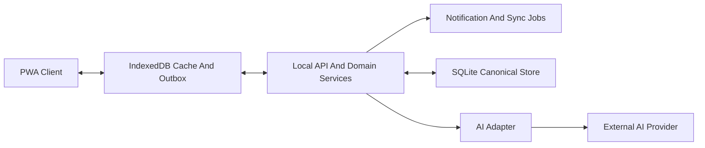

# Olivia System Architecture And Technical North Star

## Purpose
This document recommends the near-term system architecture and technology direction for Olivia so future implementation plans can be specific without reopening first-principles debates about runtime shape, data ownership, or AI boundaries.

It is intended to narrow the architecture space for M3 planning while preserving the reversibility required by Olivia's current milestone posture.

## Read Alongside
- `docs/vision/product-vision.md`
- `docs/vision/product-ethos.md`
- `docs/roadmap/roadmap.md`
- `docs/strategy/interface-direction.md`
- `docs/specs/shared-household-inbox.md`

## Status
Proposed recommendation for technical direction and implementation planning.

This document narrows the architecture space for discussion and M3 planning, but it does not supersede the higher-level deferred stack and infrastructure decisions recorded in `docs/vision/product-vision.md`.

## Architecture North Star
Olivia should be built as a `household-owned, local-first coordination system` with a `deterministic workflow core`, `sync-capable device surfaces`, and `AI assistance only at the advisory edge`.

In practical terms, that means:
- the household's durable records live in a household-controlled store
- the canonical product logic is rules-driven and auditable
- the installable PWA is the first-class surface, not a thin wrapper around chat
- every device should remain useful when temporarily offline
- external AI providers may help interpret or summarize, but they must never become Olivia's system of record

## Why This Is The Right Technical Center

### 1. The product's core problem is shared household state, not generic conversation
The product docs consistently point toward shared household state and follow-through as the first wedge. The architecture should therefore optimize for structured household records, durable status, ownership, review loops, and history rather than for chat transcript management or open-ended agent orchestration.

### 2. The trust model favors deterministic writes over agentic autonomy
Olivia is explicitly advisory-only in the first major phase. The system should therefore make every consequential write flow through deterministic validation and explicit approval steps. AI can recommend and translate, but it should not own workflow execution.

### 3. Local-first plus spouse visibility implies sync, not only single-device storage
Pure browser-local storage would fit privacy goals, but it would not support a credible household command center once more than one device needs the same state. The architecture should therefore be local-first and sync-capable rather than single-device only.

### 4. The project needs one coherent implementation center of gravity
The current product scope does not justify microservices, distributed eventing infrastructure, or multiple runtime languages. A modular monolith will be easier to reason about, test, and evolve while the household workflow is still being validated.

## North Star Pillars

### 1. Household-owned source of truth
Olivia's durable memory should live in a household-controlled data store. Device caches are helpful, but they are not the canonical record.

**Application:**
- use a household-controlled SQLite database as the canonical store for the first implementation slice
- treat browser storage as an offline cache and outbox, not the final source of truth
- keep export and backup paths straightforward because household trust depends on legible data ownership

### 2. Deterministic core, AI at the edges
The part of Olivia that records, updates, validates, schedules, and reconciles household state should be deterministic and testable without AI availability.

**Application:**
- domain services validate every write and enforce approval requirements
- suggestion scoring, stale-item detection, due-soon logic, and notification eligibility are rules-first
- AI may parse natural language, summarize state, and draft phrasing, but it does not bypass workflow rules

### 3. Offline-tolerant capture and review
The installable PWA must remain useful when a phone is offline, on weak connectivity, or opening from a notification.

**Application:**
- maintain a device-local cache of active household state
- queue user commands locally until they can sync
- prefer explicit versioned sync over assuming constant connectivity or live sessions

### 4. One canonical product model, multiple future surfaces
The PWA is the canonical surface for the MVP, but the core system should be able to support later native shells, capture bridges, or shared-display modes without a domain rewrite.

**Application:**
- keep domain models, commands, and query views surface-agnostic
- build the UI around typed APIs rather than framework-specific server magic
- treat later native shells as alternate clients over the same household model

### 5. Reversible dependencies and replaceable integrations
Olivia should avoid deep coupling to any AI vendor, notification provider, auth provider, or workflow framework while the product shape is still being proven.

**Application:**
- put AI access behind an internal adapter boundary
- keep notification delivery behind a provider interface
- prefer thin libraries for commodity problems over heavy product-shaping platforms

## Recommended System Shape

## Architectural Recommendation

### Client layer: installable mobile-first PWA
The client should be an installable PWA optimized for:
- very fast capture
- structured review
- offline cache
- notification re-entry

The client should own local UI state, optimistic interactions, and offline command queuing. It should not own the final rules for household writes.

### Application runtime: modular monolith
The first implementation should use a single application runtime with clear internal boundaries:
- `domain`: inbox items, ownership, status, history, reminder metadata, validation rules
- `application`: commands, approval flow, summaries, stale-item checks, sync orchestration
- `infrastructure`: database access, notification delivery, AI adapters, logging
- `interface`: HTTP API, background jobs, PWA asset serving, future admin or maintenance endpoints

This is intentionally a modular monolith, not a microservice system. Separate modules matter now; separate deployables do not.

### Persistence model: canonical SQLite plus device-local cache
The first durable store should be SQLite running on a household-controlled runtime. SQLite matches the current scale, local-first posture, and simplicity requirements better than a network database.

Use browser IndexedDB on each client device for:
- cached reads
- offline command queueing
- last-known summaries and item lists

Do not use IndexedDB alone as the system of record because the product must support shared household visibility and later multi-device continuity.

### Sync model: explicit pull/push with versioning
The first sync model should be simple and legible:
- clients pull household state snapshots or incremental changes
- clients push confirmed user commands from a local outbox
- the server applies commands transactionally and returns the new canonical state or change set
- records carry version metadata and update timestamps

Do not start with CRDTs, peer-to-peer sync, or full event sourcing. The current primary-operator model and low expected write concurrency do not justify that complexity yet.

### Notification model: rules-based and calm
Notifications should be generated from deterministic application rules, not ad hoc AI judgment. The near-term system should support:
- due-soon prompts
- stale-item review prompts
- optional summary digests

Notifications should be opt-in, primarily targeted at the stakeholder in the current primary-operator model, and return the user to Olivia's review flow. They should never become a second system of record.

### AI model: advisory adapter, never write authority
AI belongs behind a narrow application boundary. Recommended uses:
- parsing freeform capture into structured draft data
- generating readable summaries
- drafting suggestion phrasing

AI should not:
- write directly to durable storage
- decide whether approval is required
- become the only way to retrieve or manipulate data

## Recommended Technologies

| Area | Recommendation | Why |
|---|---|---|
| Primary language | TypeScript end-to-end | One language across client, API, domain logic, and typing reduces handoff cost for agents and keeps surface-specific logic aligned. |
| PWA client | React + Vite | Fast iteration, strong PWA support, clean separation from backend concerns, and no unnecessary server-rendering complexity for the current workflow. |
| Client routing and data fetching | TanStack Router + TanStack Query | Explicit state boundaries, offline-friendly client patterns, and minimal lock-in. |
| Browser persistence | IndexedDB via Dexie | Mature offline storage abstraction without inventing a browser persistence layer. |
| API/runtime | Node.js + Fastify | Strong TypeScript ergonomics, low overhead, mature plugin ecosystem, and straightforward structured logging. |
| Validation | Zod | Shared schemas at API boundaries and command validation points. |
| Database | SQLite + Drizzle ORM | Local-first fit, simple operations, typed schema management, and enough structure without heavyweight abstraction. |
| PWA/service worker | `vite-plugin-pwa` with Workbox underneath | Commodity installability, caching, and update behavior should be bought, not written from scratch. |
| Dates and natural language time parsing | `date-fns` + `chrono-node` | Household reminder workflows need reliable date handling without building a date parser. |
| Notifications | Web Push with a thin provider wrapper | Web push fits the PWA direction and keeps provider choice reversible. |
| AI integration | Provider SDK behind an internal `AiProvider` interface | Olivia needs replaceability and clear control of what data crosses the boundary; a large agent framework is unnecessary now. |
| Logging | Pino structured logs | Durable, low-overhead logs for sync, approval, and notification debugging. |

## Why Not Use A Single More Complete Stack

TanStack is compelling, and this recommendation already leans on it where it most clearly fits the product:
- TanStack Router for client navigation and route-state structure
- TanStack Query for client/server state boundaries, caching, and revalidation patterns

The reason not to standardize more aggressively on the broader TanStack ecosystem is not that a single ecosystem is inherently bad. It is that Olivia's highest-risk technical questions are not generic React app questions. They are:
- what the canonical household data store should be
- how local-first sync should work across devices
- how approval-gated writes should be enforced
- where AI boundaries should sit in an advisory-only system

For those concerns, this recommendation prefers narrower and more explicit seams over broader stack unification.

### Why not TanStack DB as the center
TanStack DB is promising, but Olivia's current architecture needs a very clear distinction between:
- the household-controlled canonical store
- the device-local offline cache
- the explicit command-sync path between them

Using SQLite plus Drizzle for the canonical store and Dexie for browser-local persistence keeps those roles legible. That makes the trust model, sync model, backup story, and future surface expansion easier to reason about while the product is still proving its first workflow.

### Why not TanStack AI as the center
TanStack AI is aligned with vendor-neutral AI integration, which is good, but Olivia's current AI posture is intentionally narrow. The product does not yet need an AI-centric application runtime or tool orchestration layer. It needs:
- a replaceable provider adapter
- strict control of what household data leaves the local boundary
- deterministic write rules that AI cannot bypass

That is easier to preserve with a thin internal AI boundary than with a more expansive AI framework at this stage.

### The trade-off
An all-in-one stack would reduce the number of technologies in play and could speed some integration work. The downside is correlated abstraction risk: if Olivia later needs to change its persistence, sync, or AI boundary, more of the system would be coupled to one evolving ecosystem choice.

For Olivia's current phase, the better principle is:
- use TanStack heavily where the problem is clearly client-state and routing
- use simpler, best-fit technologies where the problem is canonical data ownership, sync semantics, and AI boundary control

## Library Usage Versus Building It Ourselves

### Use libraries aggressively for commodity capabilities
Olivia should not spend early effort rebuilding:
- UI rendering and routing
- browser persistence primitives
- schema validation
- service-worker plumbing
- date parsing and normalization
- SQL migrations and typed query generation
- push protocol plumbing
- authentication later, if remote access expands beyond a tightly controlled prototype

### Build Olivia's own logic where the product differentiates
Olivia should own:
- the household item and follow-through domain model
- the approval and confirmation pipeline
- stale-item and due-soon decision logic
- summary composition rules
- sync semantics for household records
- audit history and reversible write behavior

These are not generic infrastructure concerns. They are the product's trust model encoded in software.

### Avoid heavy frameworks that decide the product shape for us
Do not start with:
- microservices
- LangChain-style orchestration frameworks
- CRDT platforms
- event-bus infrastructure
- generalized workflow engines

Those tools solve problems Olivia does not yet have and would make the first implementation harder to reason about.

## Near-Term Delivery Path

### Phase 1: Single household runtime, PWA first
Start with one household-controlled runtime serving:
- the API
- the PWA assets
- the SQLite store
- background notification and sync jobs

This could run on a stakeholder-controlled machine for early validation and later move to a small always-on household host without changing the application shape.

### Phase 2: Household-accessible deployment
Once real use validates the workflow, make the runtime reliably household-accessible across devices. The architecture should support this without reworking domain logic or persistence.

This document intentionally does not lock the remote access method. The current recommendation is to preserve a self-hosted posture and defer the exact remote-access mechanism until implementation planning.

### Phase 3: Additional clients only if usage proves the need
If the PWA proves insufficient for notifications, widgets, capture flows, or shared-display needs, add a native shell or secondary surface on top of the same APIs and domain model.

## How The North Star Applies To The Roadmap

### Horizon 2: Useful MVP
The architecture directly supports the shared household inbox spec with:
- fast mobile capture
- durable local-first storage
- deterministic approval-gated writes
- calm notification loops

### Horizon 3: Household Coordination Layer
The same domain and sync core can expand into richer ownership, spouse participation, and stronger review workflows without a storage rewrite.

### Horizon 4: Household Memory And Planning
The audit history, durable records, and summary layer create the right substrate for later recall, planning rituals, and longitudinal household memory.

### Horizon 5: Selective Trusted Agency
If Olivia later earns limited automation, the approval pipeline and adapter boundaries provide a legible place to introduce bounded execution rules without replacing the core architecture.

## Alternatives Considered

### Server-first cloud SaaS
Rejected for now because it conflicts with the current local-first and privacy-first posture. It may later become a deployment option, but it should not be the architecture's default assumption.

### Pure local browser app with no shared runtime
Rejected because it would make spouse visibility, multi-device continuity, and durable household-shared state too fragile.

### Native-mobile-first architecture
Rejected as a first commitment because the workflow does not yet require native-only capabilities and the project benefits more from faster validation and reversible choices.

### Event-sourced or CRDT-heavy local-first stack
Rejected for now because the product's current concurrency model is simple and the domain is not yet proven enough to justify advanced sync machinery.

## Facts
- Olivia's canonical near-term surface is an installable mobile-first PWA.
- Olivia's trust model is advisory-only in the first major phase.
- Household data is sensitive and should remain household-controlled.
- The first implementation target is the shared household inbox workflow.
- The project is still early enough that reversibility is more valuable than platform maximalism.

## Decisions
Within this recommendation, the following decisions are proposed for near-term planning:
- The near-term system shape should be a TypeScript modular monolith with clear internal boundaries rather than microservices.
- The first canonical durable store should be SQLite on a household-controlled runtime.
- AI should remain outside the write-authority path and behind an internal adapter boundary.
- The first sync model should be explicit pull/push with versioning, not CRDT-first or peer-to-peer.
- Commodity infrastructure should be bought with focused libraries; Olivia-specific workflow and trust logic should be built in-house.

## Assumptions
- A household-controlled runtime is acceptable for early use even if the exact remote-access method is still undecided.
- Web Push will be sufficient for the first notification posture on the chosen PWA surface.
- The first household workflow will have low enough concurrency that versioned sync is enough without CRDTs.
- A single TypeScript stack will improve delivery speed and reduce agent handoff friction more than a mixed-language architecture would.

## Open Questions
- What remote access model best balances local-first control with low-friction household usage outside the home?
- Is Web Push reliable enough for the stakeholder's actual notification needs, or will that force a native shell sooner?
- What lightweight authentication model is appropriate once spouse usage moves beyond a tightly controlled prototype?
- At what point does spouse participation require conflict handling stronger than versioned command sync?

## Deferred Decisions
- Exact remote-access mechanism for the household-controlled runtime.
- Exact authentication implementation and account lifecycle.
- Whether a native shell is needed after real PWA usage.
- Whether later workflows justify richer sync or background-processing infrastructure.
